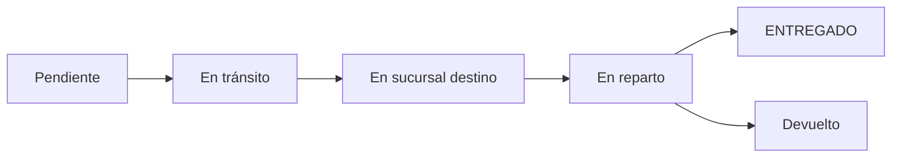

## Overview

App Courier provides comprehensive delivery tracking and driver assignment capabilities. Administrators can assign packages to drivers, monitor delivery progress in real-time, and maintain complete delivery history.

## Package Status Lifecycle

Packages progress through multiple statuses from creation to delivery:



### Status Descriptions

<AccordionGroup>
  <Accordion title="Pendiente - Pending">
    Package has been created but not yet picked up or in transit. Waiting for initial processing.
  </Accordion>
  
  <Accordion title="En tránsito - In Transit">
    Package is moving between branches or locations. Currently being transported.
  </Accordion>
  
  <Accordion title="En sucursal destino - At Destination Branch">
    Package has arrived at the destination branch and is ready for final delivery or pickup.
  </Accordion>
  
  <Accordion title="En reparto - Out for Delivery">
    Package has been assigned to a driver and is currently being delivered to the recipient.
  </Accordion>
  
  <Accordion title="ENTREGADO - Delivered">
    Package has been successfully delivered to the recipient. Final status.
  </Accordion>
  
  <Accordion title="Devuelto - Returned">
    Package could not be delivered and has been returned to sender or origin branch.
  </Accordion>
</AccordionGroup>

## Status History Tracking

Every status change is logged with detailed information:

```dart
class HistorialEstado {
  String? estado;        // Status name
  String? fecha;         // Date of change
  String? hora;          // Time of change
  String? usuario;       // User who made the change
  String? colorEstado;   // Color for UI display
}
```

### Viewing Status History

<Steps>
  <Step title="Open Package Details">
    Select package from the list
  </Step>
  
  <Step title="View History Tab">
    Click "Historial de Estados" or "Ver Historial"
  </Step>
  
  <Step title="Review Timeline">
    See complete chronological history:
    - Each status change
    - Date and time of change
    - User who updated status
    - Visual timeline display
  </Step>
</Steps>

<Note>
  Status history is permanent and cannot be deleted, providing a complete audit trail for each package.
</Note>

## Driver Assignment

Assign packages to drivers (motorizados) for home delivery.

### When to Assign Drivers

Drivers should be assigned when:
- Package delivery type includes home delivery
- Package has arrived at destination branch ("En sucursal destino")
- Recipient address is confirmed
- Package is ready for final delivery

### Assignment Process

<Steps>
  <Step title="Select Package">
    Navigate to package details that needs delivery
  </Step>
  
  <Step title="Click Assign Driver">
    Select "Asignar Motorizado" button
  </Step>
  
  <Step title="View Available Drivers">
    See list of drivers at the branch:
    - Driver name and document
    - Current workload
    - Contact information
  </Step>
  
  <Step title="Select Driver(s)">
    - Choose primary driver
    - Optionally add secondary driver for backup
    - Multiple drivers can be assigned to same package
  </Step>
  
  <Step title="Confirm Assignment">
    Driver receives notification and package appears in their delivery list
  </Step>
</Steps>

### Driver Model

```dart
class Motorizado {
  int? id;
  int? idUsuario;
  String? nombres;
  String? nroDocumento;
  String? celular;
  int? idTipoUsuario;  // User type: 4 (primary) or 5 (secondary)
  int? idSucursal;
}
```

<Tip>
  Assign packages to drivers based on delivery zones to optimize routes and reduce delivery time.
</Tip>

## Tracking Methods

Multiple ways to track package location and status:

### 1. Quick Search

Search by remito number for instant package lookup:

```dart
GET /encomienda/getEncomiendaByRemito?remito=REM-001234
```

### 2. Package List Filters

Filter packages by:
- **Date Range**: Today, this week, custom range
- **Status**: Any status or specific status
- **Branch**: Origin or destination branch
- **Driver**: Packages assigned to specific driver
- **Customer**: All packages for a customer

### 3. Driver View

Drivers see their assigned packages:
- Pending deliveries
- Completed deliveries today
- Delivery addresses and routes
- Customer contact information

### 4. Customer View

Customers track their packages:
- Enter remito number in app
- View current status
- See delivery history
- Estimated delivery date

## Real-Time Updates

Status updates are reflected immediately:

<Tabs>
  <Tab title="Admin Updates">
    When admin updates package status:
    1. Status saved to database
    2. History entry created
    3. Customer notification sent (if configured)
    4. Driver updated (if assigned)
  </Tab>
  
  <Tab title="Driver Updates">
    When driver updates status from app:
    1. Status updated via mobile app
    2. Location captured (if available)
    3. Photo attached (proof of delivery)
    4. Timestamp recorded
    5. Customer can see update immediately
  </Tab>
</Tabs>

## Delivery Workflow

### For Home Delivery Packages

<Steps>
  <Step title="Package Arrives at Destination">
    Status: "En sucursal destino"
    - Package reaches destination branch
    - Ready for final delivery
  </Step>
  
  <Step title="Assign to Driver">
    Admin assigns package to available driver
    - Driver receives notification
    - Package details visible in driver app
  </Step>
  
  <Step title="Driver Accepts">
    Driver reviews delivery:
    - Checks address and contact info
    - Plans delivery route
    - Status: "En reparto"
  </Step>
  
  <Step title="Out for Delivery">
    Driver attempts delivery:
    - Contacts recipient
    - Navigates to address
    - Multiple attempts if needed
  </Step>
  
  <Step title="Delivery Completed">
    Successful delivery:
    - Takes proof of delivery photo
    - Updates status to "ENTREGADO"
    - Records recipient name/signature
    - Completes delivery
  </Step>
  
  <Step title="Alternative: Return" optional>
    If delivery fails:
    - Updates status to "Devuelto"
    - Adds notes about failure reason
    - Returns package to branch
  </Step>
</Steps>

## Package Images

Attach photos to packages for documentation:

### Image Types

- **Package condition**: Document package state
- **Proof of delivery**: Show delivered package
- **Address confirmation**: Verify delivery location
- **Damage documentation**: Record any damage

### Managing Images

<Steps>
  <Step title="Open Package Details">
    Select package from list
  </Step>
  
  <Step title="Access Images">
    Click "Imágenes" or image icon
  </Step>
  
  <Step title="Add Photo">
    - Take photo with camera
    - Upload from gallery
    - Add description/notes
  </Step>
  
  <Step title="View Gallery">
    All package photos displayed in gallery view
  </Step>
</Steps>

## Driver Performance Tracking

Monitor driver efficiency and performance:

### Metrics Available

- **Deliveries Completed**: Total successful deliveries
- **Delivery Rate**: Percentage of successful deliveries
- **Average Delivery Time**: Time from assignment to delivery
- **Active Packages**: Currently assigned packages
- **Returns**: Packages returned to branch

### Viewing Driver History

<Steps>
  <Step title="Navigate to Drivers">
    From admin panel, select "Motorizados"
  </Step>
  
  <Step title="Select Driver">
    Click on driver name
  </Step>
  
  <Step title="View History">
    See complete delivery history:
    - All assigned packages
    - Delivery dates and times
    - Success/failure rate
    - Customer feedback (if available)
  </Step>
</Steps>

## Notifications

<Note>
  While push notifications are not currently implemented, the system logs all status changes for customer queries.
</Note>

Customers can check package status:
- Login to customer app
- Enter remito number
- View current status and history

## Troubleshooting Deliveries

<AccordionGroup>
  <Accordion title="Package stuck in 'En tránsito'">
    **Solution**: Verify package arrived at destination branch. Update status to "En sucursal destino" once confirmed.
  </Accordion>
  
  <Accordion title="Driver cannot find address">
    **Solution**: 
    - Contact customer for better directions
    - Update package with landmark references
    - Assign different driver familiar with area
  </Accordion>
  
  <Accordion title="Recipient not available">
    **Solution**:
    - Driver attempts contact via phone
    - Schedule redelivery attempt
    - If multiple failures, return to branch and contact sender
  </Accordion>
  
  <Accordion title="Wrong delivery address">
    **Solution**:
    - Contact customer to verify correct address
    - Update package details
    - Reassign to driver with correct address
  </Accordion>
</AccordionGroup>

## Best Practices

<Tip>
  **Group deliveries by zone**: Assign multiple packages in the same area to one driver to improve efficiency.
</Tip>

<Note>
  **Update status promptly**: Keep customers informed by updating package status as soon as changes occur.
</Note>

<Warning>
  **Verify addresses before assignment**: Confirm delivery addresses are complete and accurate before assigning to drivers.
</Warning>

## API Reference

For programmatic delivery tracking:

<CardGroup cols={2}>
  <Card title="Status History" icon="clock-rotate-left" href="/api/packages/status">
    GET /encomienda/getHistorialEstados
  </Card>
  <Card title="Update Status" icon="arrow-up" href="/api/packages/status">
    POST /encomienda/addEstadoEncomienda
  </Card>
  <Card title="Assign Drivers" icon="user-plus" href="/api/packages/create">
    POST /encomienda/addMotorizados
  </Card>
  <Card title="Track Package" icon="location-dot" href="/api/packages/track">
    GET /encomienda/getEncomiendaByRemito
  </Card>
</CardGroup>

## See Also

- [Package Management](/features/package-management)
- [Driver Guide](/guides/driver-guide)
- [Admin Guide](/guides/admin-guide)